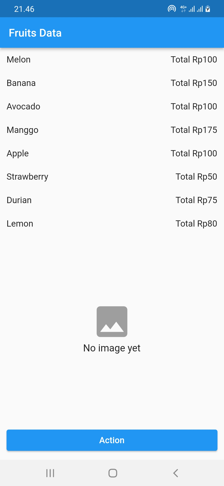
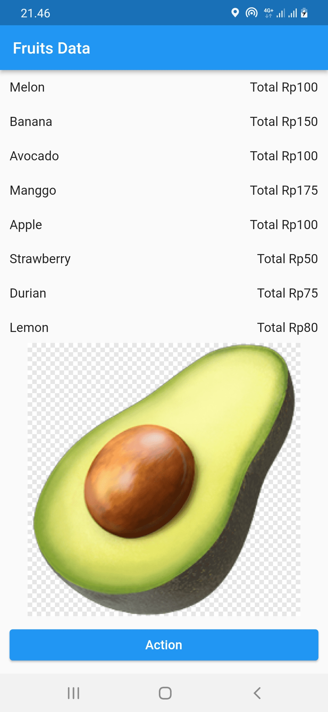
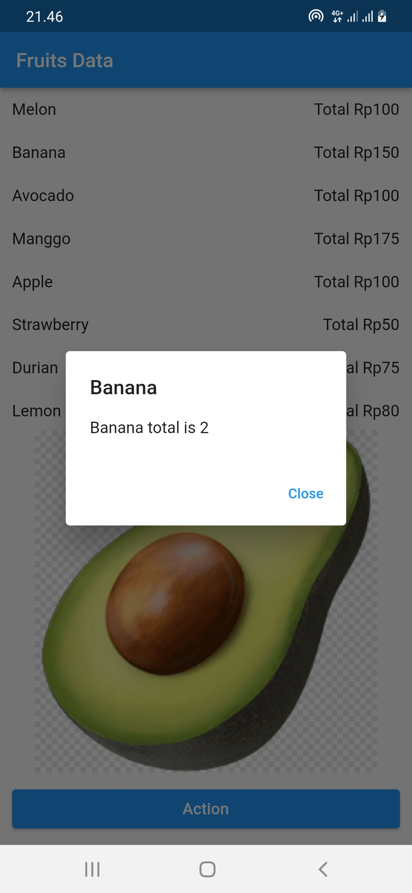

# Fruits Inventory

Fruits Inventory App build with Flutter.

  &nbsp; &nbsp; &nbsp; &nbsp;

  &nbsp; &nbsp; &nbsp; &nbsp;

## Supported devices
Fruits Inventory App has been built to support:

- Android (sdk version 16 - sdk version 31)

## Requirements

- Dart sdk: ">=2.16.2 <3.0.0"
- Flutter: ">=2.0.0"

## Getting Started

- Once you have cloned this repo, navigate to the root of this repo.
- Run `flutter pub get`.
- Run project.
- Done!

## Build Android

- Once you have cloned this repo, navigate to the root of this repo.
- Run `flutter build apk --split-per-abi` in the root of this repo for build apk or
- Run `flutter build appbundle` in the root of this repo for build appbundle

The release is created at [project]/build/app/outputs.